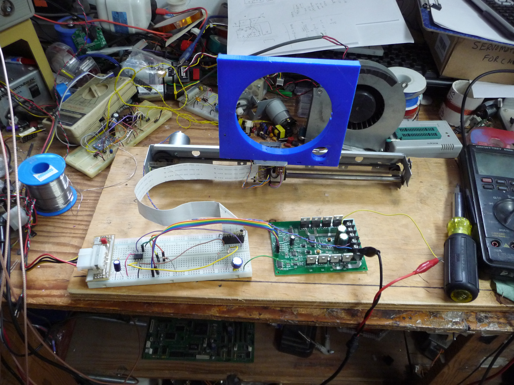

# FollowerRing
IR distance tracking demo gadget. As seen on the internet.

This is a 1D version, I had intended to make a 2d version, but I have
another idea.

Consider this a starter package.

I encourage you to use whatever you have available for a slider. 
 Here, I have used the slider from a retired inkjet printer as a 
 slider. The initial idea with the 3d printed part was to have it
 ride on drive cables, but it didn't work out. 
 Anything driven by a DC motor will do. You May have to adjust the
 gain (your motor drive voltage) to suit your build.
 
The IR parts are normal IR LEDs and IR phototransistors. I discovered
 that some of my IR LEDs have extremely different output levels. 
 You can use a camera to get an idea if the output of the LEDs is
 approximitly the same.
 
Ask questions, I built it, I dont know what details I might have 
 missed for you to give it a try!
 
[https://www.youtube.com/watch?v=vxrbg0bgX90](https://www.youtube.com/watch?v=vxrbg0bgX90)

  Rue
